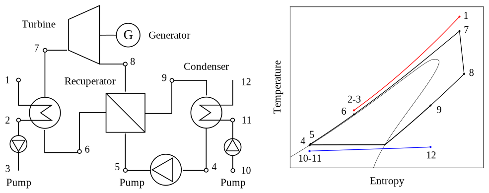

# RankineLab

## Description

`RankineLab` is a MATLAB tool for the thermodynamic analysis and optimization of Rankine cycles. The code was developed aiming at simplicity and flexibility in terms of cycle configuration and operating conditions. Some of the notable features of the code are listed below:

- Supports simple and recuperated Rankine cycle architectures.
- Supports a wide range of cycle configurations, including: trilateral, partial-evaporation, saturated, superheated, transcritical, and supecritical cycles.
- Supports a wide range of fluids, such as water, carbon dioxide, refrigerants, hydrocarbons and siloxanes.
- Supports first law (energy) and second law (exergy) cycle analyses.
- Uses the equations of state of the [CoolProp](http://www.coolprop.org/) or [REFPROP](https://pages.nist.gov/REFPROP-docs/) fluid libraries to compute the thermodynamic properties of the fluids.
- Uses the gradient-based algorithms of the [MATLAB Optimization Toolbox](https://se.mathworks.com/products/optimization.html) to find the optimal cycle configuration in a systematic way. The usual execution time for one cycle optimization is less than 10 seconds on a single core.

<figure>
	 
</figure>
Process flowsheet and _T_-_s_ diagram of a recuperated Rankine cycle

## Installation

In order to use `RankineLab` you need a MATLAB installation and the MATLAB Optimization Toolbox. In addition you need to install CoolProp and interface it with MATLAB through Python. This may sound complicated, but it is not! Check the step-by-step instructions below to learn how to interface MATLAB with CoolProp in a Windows operating system. The installation for Linux or Mac operating systems would be similar.

#### Step 1 - Download and install Miniconda

Download the [Miniconda](https://docs.conda.io/en/latest/miniconda.html) environment management system and follow the installation instructions.

#### Step 2 - Create a virtual environment and install CoolProp

Open a Miniconda terminal (look for "Anaconda Prompt" or "Miniconda3"). Once the terminal is open, type the following command to create a new virtual environment named `coolprop_env`:

```shell
conda create --name coolprop_env python=3.8
```

Don't worry if you are not familiar with the command window or with virtual environments, you only have to type two more commands before the installation is complete. Now that the environment is created, you can activate it. Just use the following command:

```shell
conda activate coolprop_env
```

Finally, type the following command to install CoolProp:

```shell
conda install CoolProp --channel conda-forge
```

That's it! Note that it was necessary to tell Miniconda that it should look for Coolprop in the `conda-forge` channel.

#### Step 3 - Interface MATLAB and Coolprop

Open MATLAB (or close and open it if it was already open) and type the following command to let MATLAB know where is the Python executable (python.exe) of the virtual environment that you have just created:

```matlab
pyversion C:\Users\rober\.conda\envs\coolprop_env\python.exe
```

Note that, in my case, the executable was located at the path `C:\Users\rober\.conda\envs\coolprop_env\`. You should replace this part with the correct path in your computer.

Good! You have installed CoolProp and interfaced it with MATLAB. Let's do a simple test to check if the installation was successful. We are going to use CoolProp to compute the saturation temperature of water at atmospheric pressure. Just type the following command in MATLAB: 

```matlab
py.CoolProp.CoolProp.PropsSI('T','P',101325,'Q',0,'Water')
```


If it does not throw and error and returns 373.1243 K the installation was successful.

## Getting started

The best way to learn how to use `RankineLab` is to open one of the [examples](.examples) and start playing around with the different parameters and settings. The examples have plenty of comments to guide the users and help them understand how the code works.

## Mathematical background

Check out the [technical note](RankineLab_technical_note.pdf) if you want to learn more about the formulation of the optimization problem and the thermodynamic modeling behind `RankOpt`.

## License

`RankineLab` is licensed under the terms of the MIT license. See the [license file](LICENSE.md) for more information.

## Contact information

`RankineLab` was developed by [Roberto Agromayor](https://www.ntnu.edu/employees/roberto.agromayor) and of Associate Professor [Lars O. Nord](https://www.ntnu.edu/employees/lars.nord) at the [Norwegian University of Science and Technology (NTNU)](https://www.ntnu.no/). Please, drop us an email to [roberto.agromayor@ntnu.no](mailto:roberto.agromayor@ntnu.no) if you have questions about the code or you have a bug to report!